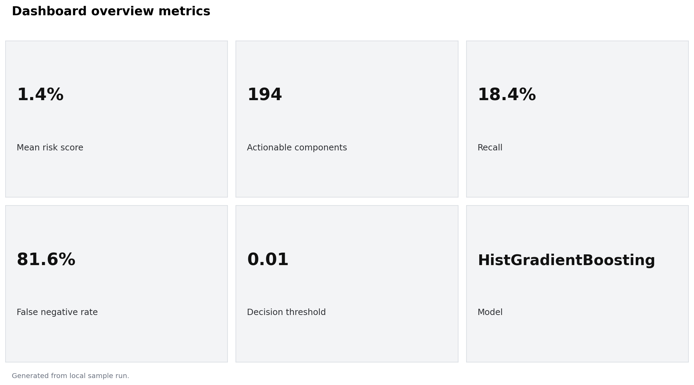
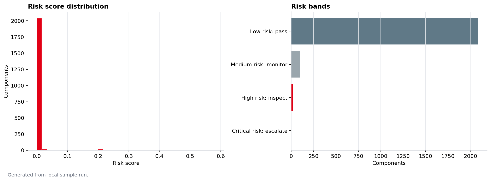
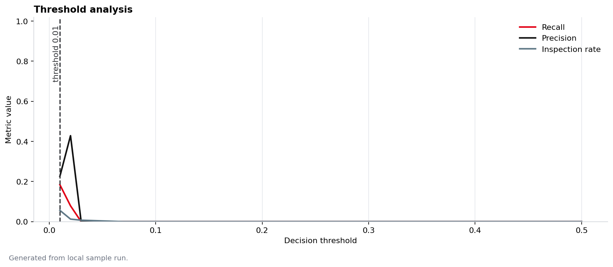
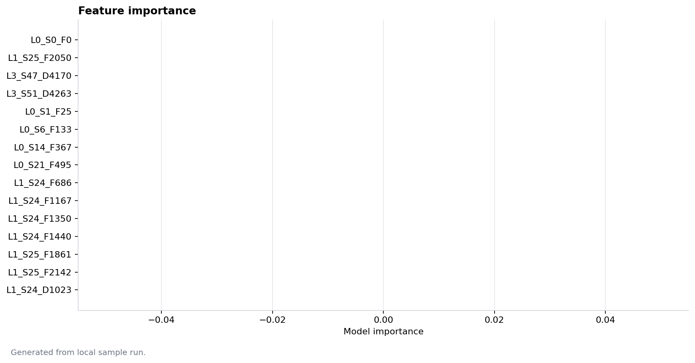
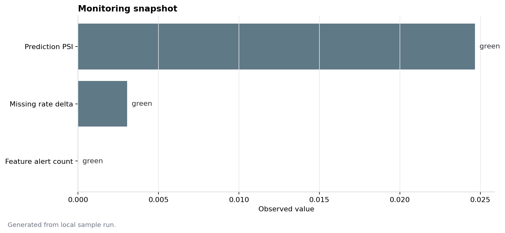

# Responsible Industrial AI for Bosch Manufacturing Quality

Predictive quality risk scoring using the Kaggle Bosch Production Line Performance dataset.

This repository is a lightweight engineering prototype. It samples the public Bosch dataset, trains a tabular risk model, writes reproducible artifacts, scores components, exposes a small API, and provides monitoring/governance documentation. It is not production-ready and does not claim operational performance outside the sampled dataset.

The project avoids Bosch logos and copyrighted assets. The dashboard uses a restrained red, black, white, and gray visual style.

## What this project does

- Builds a compact joined sample from numeric, date, and categorical Bosch files.
- Parses Bosch feature names such as `L3_S32_F3850` into line, station, feature id, and feature type.
- Adds process-coverage features such as observed feature count, station coverage, line coverage, and process-time span.
- Trains a class-imbalance-aware model when the required ML libraries are installed.
- Selects a decision threshold using recall-oriented operating logic.
- Saves metrics, threshold analysis, confusion matrix, feature importance, and metadata.
- Scores components with a consistent stored threshold.
- Simulates monitoring outputs for missingness and drift.
- Provides a Streamlit dashboard and a minimal FastAPI scoring service.

## Repository structure

```text
.
├── api/                     # FastAPI scoring service
├── artifacts/               # Generated by training and monitoring, ignored by git
├── dashboard/               # Streamlit dashboard
├── data/
│   ├── raw/                 # Optional local Kaggle files, ignored by git
│   ├── processed/
│   └── sample/              # Small runnable sample and scored outputs
├── docs/                    # Technical notes
├── executive/               # Business-facing summaries
├── governance/              # Model/data/risk operating documents
├── notebooks/               # Exploratory notebooks
├── reports/                 # Technical report
├── src/                     # Reusable pipeline code
└── tests/                   # Unit tests
```

## How to run locally

Place the Kaggle ZIP files in `data/raw/`, or point the project to their location:

```bash
export BOSCH_DATA_SOURCE_DIR="$HOME/Downloads/bosch-production-line-performance"
```

Install dependencies:

```bash
make install
```

Run the local pipeline:

```bash
make sample
make train
make evaluate
make score
make monitor
make visuals
```

Run checks:

```bash
make lint
make test
```

Start the dashboard:

```bash
make dashboard
```

## Visual walkthrough

The figures below are generated from local pipeline outputs. Run `make sample`, `make train`, `make score`, `make monitor`, and `make visuals` to regenerate them.

Generated from local sample run.

### Streamlit dashboard overview



### Risk distribution and risk bands



### Threshold analysis



### Feature importance



### Monitoring snapshot



### API scoring example

Run the API after `make train`:

```bash
python3 -m uvicorn api.main:app --reload
```

Score a component record:

```bash
curl -X POST http://127.0.0.1:8000/score \
  -H "Content-Type: application/json" \
  -d '{"records":[{"Id":1,"L0_S0_F0":0.03,"L0_S0_F2":-0.034}]}'
```

The response includes `risk_score`, `decision_threshold`, `is_actionable`, `risk_band`, `recommended_action`, `model_version`, and `scoring_timestamp`.

## Pipeline outputs

`make sample` writes:

- `data/sample/bosch_training_sample.csv`
- `data/sample/sample_profile.csv`
- `data/sample/readiness_score.json`

`make train` writes real training artifacts:

- `artifacts/metrics.json`
- `artifacts/threshold_table.csv`
- `artifacts/threshold_cost_table.csv`
- `artifacts/feature_importance.csv`
- `artifacts/confusion_matrix.csv`
- `artifacts/model_metadata.json`
- `artifacts/leakage_feature_audit.csv`
- `models/bosch_quality_risk_model.joblib`

`make score` writes:

- `data/sample/scored_components_sample.csv`

`make monitor` writes:

- `artifacts/monitoring_snapshot.json`
- `artifacts/monitoring_features.csv`

## Validation strategy

The default training path uses an ID-based ordered holdout when possible. If that split does not contain both target classes, it falls back to a stratified random baseline.

The random split is only a development baseline. In production-line data, leakage can come from process-timing features, downstream station measurements, or labels captured after the decision point. A proper validation design should use event-time splits and only include features available at scoring time.

See [docs/validation_strategy.md](docs/validation_strategy.md).

## Scoring API

Start the API after training:

```bash
uvicorn api.main:app --reload
```

Health check:

```bash
curl http://127.0.0.1:8000/health
```

Score records:

```bash
curl -X POST http://127.0.0.1:8000/score \
  -H "Content-Type: application/json" \
  -d '{"records":[{"Id":1,"L0_S0_F0":0.03,"L0_S0_F2":-0.034}]}'
```

The API returns `503` with a clear message if the model artifact is missing.

## Dashboard

The Streamlit dashboard reads real artifacts from `artifacts/` and scored rows from `data/sample/`. If those files are missing, it enters demo mode and displays:

> Demo mode: synthetic outputs. Run the training pipeline to generate real model outputs.

Dashboard pages:

- Executive Overview
- Production Risk Intelligence
- AI Governance & Monitoring
- Strategic Recommendation

## Monitoring

Monitoring is intentionally lightweight. It computes:

- prediction drift summary
- feature-level PSI for selected numeric features
- missingness drift summary
- alert flags
- retraining alert indicator

These checks are early-warning signals. True performance monitoring requires delayed defect labels from the quality process.

## Technical limitations

- The public dataset uses anonymized features, so feature importance cannot be translated into root-cause actions without station metadata.
- The sample path is designed for local execution, not full-scale training on all raw files.
- ID-based holdout is a proxy. Real deployment needs event-time validation.
- Threshold costs use illustrative false-negative and false-positive assumptions unless replaced with plant-specific cost data.
- The API and dashboard are prototypes. They do not include authentication, deployment hardening, or operational audit storage.

## Next improvements

- Replace ID holdout with timestamp-based validation once event-time metadata is available.
- Map high-importance anonymized features to real stations and tests.
- Add calibration analysis and confidence intervals.
- Add a small Dockerfile for reproducible local serving.
- Capture human review outcomes and delayed labels for monitoring.
- Add model-card updates from the generated artifacts.
