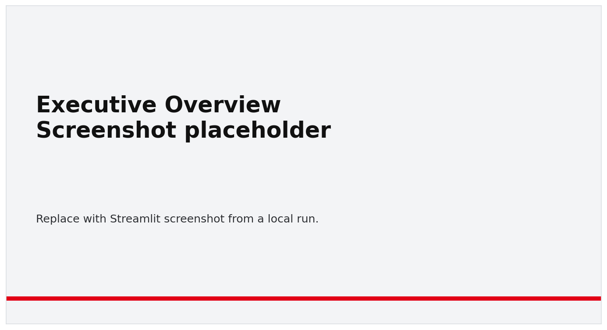
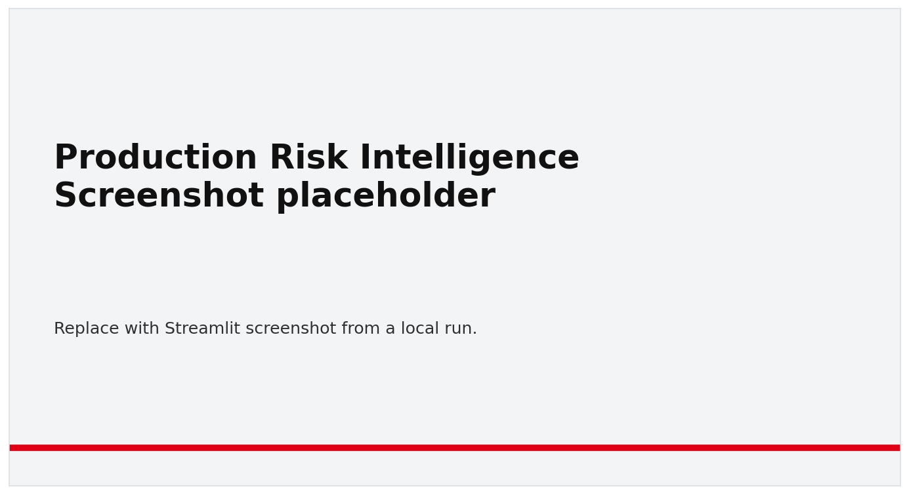
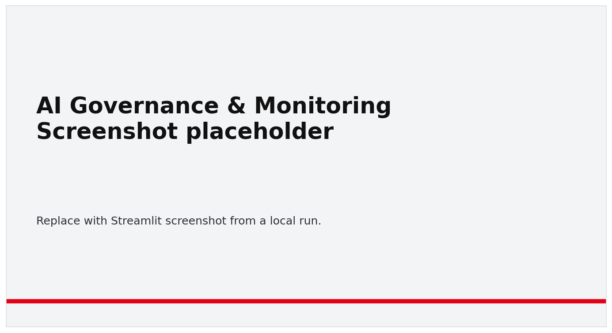
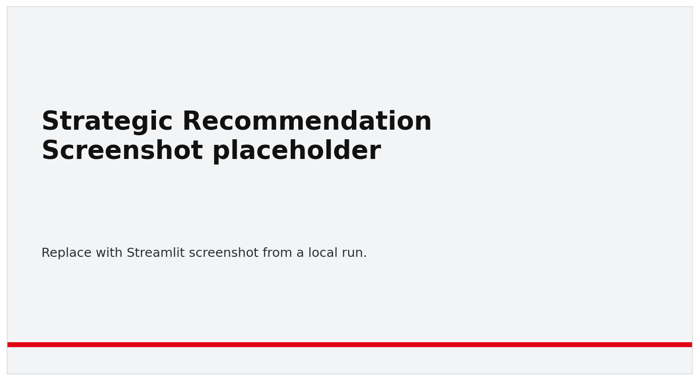
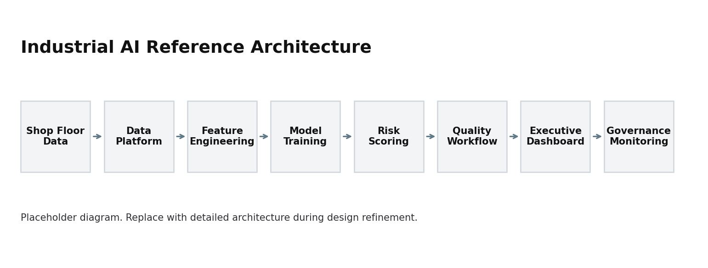

# Bosch Manufacturing Quality Intelligence

Predictive risk scoring, inspection prioritization, and AI governance for industrial operations

Independent portfolio case study based on the public Bosch Production Line Performance dataset. This project is not affiliated with, endorsed by, or sponsored by Bosch.

This repository shows how a manufacturing quality team could frame, validate, and govern a predictive risk scoring workflow. The prototype samples the public Kaggle data, trains a tabular model, scores components by defect risk, and connects the outputs to inspection prioritization, monitoring, and executive decision-making. It is a local, reproducible case study rather than a production system.

## Executive Snapshot

| Dimension | Summary |
|---|---|
| Business challenge | Earlier identification of high-risk components and reduction of avoidable quality cost |
| Decision owner | COO, Chief Quality Officer, CDO / CAIO |
| AI capability | Component-level manufacturing quality risk scoring |
| Operating model | Human-in-the-loop inspection prioritization |
| Core KPIs | Recall, false negative rate, inspection efficiency, defect capture rate |
| Governance focus | Data quality, threshold accountability, drift monitoring, auditability |
| Deployment status | Portfolio prototype with enterprise architecture blueprint |

## Product Preview

### Executive Overview


### Production Risk Intelligence


### AI Governance & Monitoring


### Strategic Recommendation


## Business Problem

Manufacturing quality teams need to detect high-risk components earlier while managing inspection capacity, production flow, and operational cost. A predictive quality model can support this decision by ranking components according to risk and routing attention toward the cases most likely to need inspection.

The model output is treated as decision support. Risk bands help prioritize inspection capacity and escalation, while quality leaders retain authority over high-impact operational decisions.

## What This Project Demonstrates

This case study connects manufacturing quality problem framing with the technical controls needed for credible AI adoption. It starts with data readiness and feature lineage, builds a component-level risk scoring model, and uses threshold analysis to translate probabilities into operational decision bands. The dashboard presents model outputs in a format suitable for quality and operations leaders, while the governance documents define threshold accountability, human review, monitoring, incident response, and approval workflow.

The intended message is practical: predictive quality work is as much about decision design, operating controls, and monitoring as it is about model training.

## Architecture Overview

Reference architecture:

`Shop Floor Data -> Data Platform -> Feature Engineering -> Model Training -> Risk Scoring -> Quality Workflow -> Executive Dashboard -> Governance Monitoring`



The implementation uses local files and Python modules to keep the project runnable on a laptop. The architecture documents describe how the same pattern would map to a managed data platform, feature store, model registry, scoring API, dashboard layer, and monitoring controls.

## Dashboard Overview

The Streamlit dashboard reads training artifacts from `artifacts/` and scored component outputs from `data/sample/`. It includes:

- Executive risk KPIs and action volume.
- Risk score distribution and risk-band mix.
- Top model features from the trained artifact.
- Monitoring status for drift and missingness.
- A 90-day pilot recommendation.

If model artifacts are missing, the dashboard enters demo mode and displays a visible warning.

## Visual Walkthrough

The figures below are generated from local pipeline outputs. Run `make sample`, `make train`, `make score`, `make monitor`, and `make visuals` to regenerate them.

Generated from local sample run.

### Local Dashboard Overview


### Risk Distribution and Risk Bands


### Threshold Analysis


### Feature Importance


### Monitoring Snapshot


## Model Evaluation

Final values should be generated from a reproducible local training run.

| Metric | Value | Why It Matters |
|---|---:|---|
| ROC-AUC | Generated locally | General ranking quality |
| PR-AUC | Generated locally | More relevant under class imbalance |
| Recall | Generated locally | Ability to capture actual failures |
| False Negative Rate | Generated locally | Operational risk indicator |
| Inspection Rate | Generated locally | Impact on quality team workload |

The local training pipeline writes `artifacts/metrics.json`, `artifacts/threshold_table.csv`, and `artifacts/confusion_matrix.csv`.

## Governance Artifacts

The repository includes operating documents for responsible use:

- [Model card](governance/model_card.md)
- [Data card](governance/data_card.md)
- [AI risk register](governance/ai_risk_register.md)
- [AI operating model](governance/ai_operating_model.md)
- [Threshold policy](governance/threshold_policy.md)
- [Model approval workflow](governance/model_approval_workflow.md)
- [Incident response playbook](governance/incident_response_playbook.md)
- [Quality SLA](governance/quality_sla.md)
- [Risk band decision matrix](governance/risk_band_decision_matrix.md)

## How To Run

Place the Kaggle ZIP files in `data/raw/`, or point the project to their location:

```bash
export BOSCH_DATA_SOURCE_DIR="$HOME/Downloads/bosch-production-line-performance"
```

Install dependencies:

```bash
make install
```

Run the local pipeline:

```bash
make sample
make train
make evaluate
make score
make monitor
make visuals
```

Run checks:

```bash
make lint
make test
```

Start the dashboard:

```bash
make dashboard
```

Start the scoring API:

```bash
python3 -m uvicorn api.main:app --reload
```

Example scoring request:

```bash
curl -X POST http://127.0.0.1:8000/score \
  -H "Content-Type: application/json" \
  -d '{"records":[{"Id":1,"L0_S0_F0":0.03,"L0_S0_F2":-0.034}]}'
```

## Repository Structure

```text
.
├── api/                     # FastAPI scoring service
├── artifacts/               # Generated by training and monitoring, ignored by git
├── dashboard/               # Streamlit dashboard
├── data/
│   ├── raw/                 # Optional local Kaggle files, ignored by git
│   ├── processed/
│   └── sample/              # Small runnable sample and scored outputs
├── docs/                    # Validation notes, architecture placeholder, README assets
├── executive/               # Decision memo, pilot plan, and business case simulation
├── governance/              # Model, data, threshold, risk, SLA, and approval controls
├── notebooks/               # Exploratory and decision-analysis notes
├── reports/                 # Technical report
├── scripts/                 # README asset generation
├── src/                     # Reusable pipeline code
└── tests/                   # Unit tests
```

## Limitations

- The public dataset uses anonymized features, so feature importance cannot be translated into root-cause actions without station metadata.
- The sample path is designed for local execution, not full-scale training on all raw files.
- ID-based holdout is a proxy. Real deployment needs event-time validation.
- Cost assumptions are illustrative unless replaced with plant-specific values.
- The API and dashboard are prototypes. They do not include authentication, deployment hardening, or operational audit storage.
- No Bosch affiliation, operational data access, or production validation is implied.

## Next Steps

- Replace ID holdout with timestamp-based validation once event-time metadata is available.
- Map high-importance anonymized features to real stations and tests.
- Add cost-sensitive threshold selection using validated inspection and defect-cost assumptions.
- Capture human review outcomes and delayed labels for monitoring.
- Update the model card automatically from generated artifacts.

## Suggested GitHub Metadata

Description:

> Executive-grade Industrial AI case study for predictive quality, inspection prioritization, data architecture, and AI governance using the Bosch Kaggle dataset.

Topics:

`industrial-ai`, `predictive-quality`, `manufacturing-analytics`, `ai-governance`, `data-governance`, `mlops`, `streamlit`, `xgboost`, `lightgbm`, `decision-intelligence`
